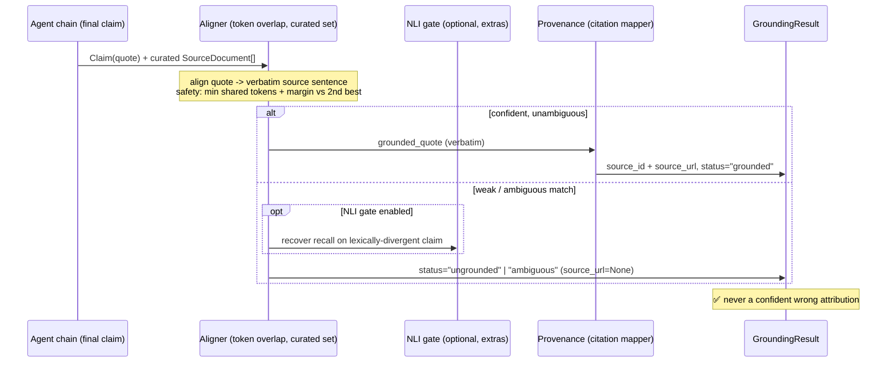

# RG-001: reground — Deterministic Provenance Reconstruction with Safe Refusal

> **Historical spec (archived).** This is the pre-implementation design
> document, kept verbatim as a record of what was planned. The shipped
> implementation diverged in places — notably: `nli_gate.py` was **not** built
> (only the `EntailmentGate` port in `src/reground/ports.py`; there is no
> `[nli]` extra), the bounded fuzzy citation fallback was dropped (its
> `fuzzy_citation_threshold` knob was removed from `GroundingConfig`), and CI
> *enforces* the benchmark via `tests/test_benchmark.py` rather than only
> regenerating it. Where this document and the code disagree, the code and
> `CHANGELOG.md` win.

> **Thesis:** *Citation provenance does not survive a chain of LLM agents. Reconstruct it deterministically at the end — align each final claim to a verbatim span within the small, already-curated source set, or refuse — never a confident wrong citation.*

## 1. Problem Statement

**What:** In multi-agent pipelines, citation provenance is lost not at the model boundary but at the **inter-agent boundary**. A retrieval step returns text with inline citations anchored to *its own* output. Downstream agents then rewrite, synthesize, and extract — and the final, user-facing text is produced by agents whose output no longer carries the original anchors. Citations are **non-transitive across independent LLM calls**: each hop compounds the loss, and the cited intermediate text is never the text the user sees.

**Why now:** Native citation features close this only at the *generation* boundary, not across a chain. Anthropic's Citations API, LlamaIndex's CitationQueryEngine and DSPy's Citations all emit citations *while answering over provided documents in a single call*; none re-ground a piece of already-synthesized external text against candidate sources. Meanwhile public 2025–2026 evaluations show the failure is real and invisible to surface metrics: citations can be >94% valid links and >80% topically relevant while only **39–77%** of them genuinely support the claim, and up to **57%** of citations in attributed RAG answers are post-rationalized rather than load-bearing. Evidence recall falls from >95% (single-doc) to **44–75%** (multi-hop) and degrades further with pipeline depth. *(Figures from public evals; the strongest accuracy numbers are industry-authored and LLM-judged — treated as motivation, not proof. The reproducible numbers in this repo come from the benchmark in §11.)*

**Impact:** Two failure modes, both worse under multi-agent depth: (a) **lost traceability** — true facts arrive with no verifiable source; (b) the more dangerous **false attribution** — a final claim is mapped to the *wrong* source. A system that cannot tell the two apart cannot be trusted to cite.

**Why a new tool (vs. what exists):** Google Vertex AI's *Check Grounding* API is the closest prior art — it grounds an already-synthesized answer candidate against a developer-supplied fact set with per-claim support scores and a full-entailment standard that yields safe refusal. But it (a) is Google-specific, not provider-neutral; (b) returns support *scores and fact indices*, not a **verbatim span + source URL**; and (c) does not thread provenance through the chain. The gap this harness fills: a **provider-neutral, deterministic, inspectable** step that takes a final claim plus the **small, already-curated source set carried forward as flat metadata**, and returns either a verbatim source span with its URL, or an explicit `ungrounded`/`ambiguous` refusal. The small candidate set (the handful of sources the retrieval step already selected) is what makes a deterministic matcher viable: with 5–15 candidates, the token-overlap over-matching that sinks open-corpus grounding largely collapses.

**Production case study (anecdote, non-reproducible):** In a prior production extraction pipeline, only **41%** of extracted quotes could be mapped back to a source; strengthening the extraction prompt ("VERBATIM ONLY / FORBIDDEN: paraphrase, combine") moved this to **48%** and plateaued — the model kept combining distant fragments despite the explicit ban. Cited only to show *why* prompt-coercion was abandoned for deterministic post-processing; it is not evidence and drives no number in this repo.

## 2. Goal

Ship a small, dependency-free Python library + a reproducible benchmark that takes a final `Claim` (produced anywhere downstream in an agent chain) plus the **small, already-curated set of `SourceDocument`s** carried forward as flat metadata, and returns a `GroundingResult` that is **either** grounded to a verbatim source span with provenance (URL), **or** an explicit, safe refusal (`ungrounded` / `ambiguous`) — never a confident wrong attribution. An optional NLI/entailment gate (behind an extra) can recover recall on semantically-supported-but-lexically-divergent claims; the deterministic core is the default and the benchmark decides whether the gate is needed.

## 3. Sequence Diagram

### Current (Problem) — trust the model

```mermaid
sequenceDiagram
    participant LLM as LLM Extractor
    participant DS as Downstream (citation/URL mapper)
    LLM->>DS: claim.quote = "paraphrased / fragment-combined text"
    Note over DS: exact match fails;<br/>char-level fuzzy can't span gaps
    DS-->>DS: ⚠️ drop attribution OR map to wrong source
```

### Target (Solution) — verify deterministically



## 4. Data Model

> New repository — schemas are defined here and will live in `src/reground/contracts.py` (single source of truth). Docs link, do not duplicate, once code exists.

### Core contract: `GroundingResult`

The single, explicit return contract. It records not just the answer but **how** it was reached and **why** — so failure modes are auditable.

| Field | Type | Meaning |
|-------|------|---------|
| `claim_id` | `str` | Stable id of the input claim |
| `original_quote` | `str` | The LLM-proposed (possibly paraphrased) quote |
| `grounded_quote` | `str \| None` | Verbatim source span the quote was aligned to (None if ungrounded) |
| `source_id` | `str \| None` | Id of the matched source unit (None if no provenance) |
| `source_url` | `str \| None` | Provenance URL (None if unmapped) |
| `status` | `Literal["grounded","ungrounded","ambiguous"]` | Outcome = the weakest link across both stages |
| `method` | `Literal["exact","jaccard"]` | Which matcher produced the alignment |
| `score` | `float` | Best similarity score (0.0–1.0) |
| `margin` | `float` | Best score minus second-best — the basis for `ambiguous → null` |
| `reason` | `str` | Human-readable justification (shared content tokens, citation distance, etc.) |
| `nli_score` | `float \| None` | Entailment score from the optional NLI gate (None when the gate is disabled — the default) |

### Supporting contracts (neutral domain)

- `SourceDocument(source_id, text, citations: list[Citation], url | None)`
- `Citation(index: int, url: str, title: str | None)` — inline `[N]` markers in `text` map to a `Citation`
- `Claim(claim_id, quote)` — a final unit of evidence, produced anywhere downstream in an agent chain
- The harness grounds a `Claim` against a **curated set** — `list[SourceDocument]` (the handful of sources the upstream retrieval already selected), not a single document.

### Benchmark case schema (`benchmark/dataset.jsonl`)

Each line:
- `case_id`, `category` (see §11), `sources[]` (each `{source_id, text, citations[], url}` — the curated set), `model_quote`
- `expected_source_id` (`str | None`) and `expected_status` (`grounded | ungrounded | ambiguous`)

## 5. Inventory — What Changes

> New repo: **`reground`** (public name on GitHub/PyPI; `pip install reground` → `from reground import ground`). Clean git, no inherited history. (`RG-001` is the internal spec id only.)

### Must Create

| File | Purpose | Risk |
|------|---------|------|
| `pyproject.toml` | Core = zero runtime deps (stdlib only); optional extras: `dev` (pytest), `nli` (entailment gate) | Low |
| `LICENSE` | MIT | Low |
| `.env.example` | Only `OPENAI_API_KEY` (used ONLY for the one-time manual fixture harvest; runtime needs nothing) | Low |
| `src/reground/contracts.py` | `Claim`, `SourceDocument`, `Citation`, `GroundingResult` | Low |
| `src/reground/align.py` | Quote→verbatim alignment across the **curated set** (multiple sources): Jaccard token overlap, fragment (`...`) splitting, **safety: min shared tokens + margin** | Medium |
| `src/reground/provenance.py` | Verbatim span → `[N]` citation → `source_id`/`source_url`; fuzzy fallback; **ambiguity guard** | Medium |
| `src/reground/harness.py` | `ground(claim, sources) -> GroundingResult` orchestration over the curated set; status = weakest link | Medium |
| `src/reground/nli_gate.py` | OPTIONAL (`extras=nli`): entailment gate to recover recall on lexically-divergent claims. Clean interface from day 1; OFF by default; benchmark decides if it's needed | Medium |
| `examples/real_model_outputs.jsonl` | ~10 REAL model outputs captured once (paraphrase/fragment), frozen as fixtures, with a provenance note (model + date) — proves inputs aren't strawmen | Low |
| `examples/sample_corpus.md` | Neutral source doc with `[N]` markers | Low |
| `examples/run_demo.py` | One-command quickstart: input → `GroundingResult` | Low |
| `benchmark/dataset.jsonl` | 25–50 neutral cases, 11 categories, zero PII | Medium |
| `benchmark/run_benchmark.py` | Reports **recall / false-attribution / safe-refusal** (explicit denominators, see AC7) by category | Medium |
| `.github/workflows/ci.yml` | GitHub Actions: run pytest + regenerate the benchmark matrix on every push — makes the headline numbers reproducible, not asserted | Low |
| `tests/test_align.py` | Alignment + token overlap unit tests | Low |
| `tests/test_provenance.py` | Citation mapping + fuzzy fallback tests | Low |
| `tests/test_safety.py` | `ambiguous→null`, `fabricated→null`, `wrong-citation-nearby→null` | High (the thesis) |
| `tests/test_harness.py` | End-to-end `ground()` contract tests | Low |
| `README.md` | Problem → what → **why + positioning vs Check Grounding / Citations API** → proof (benchmark matrix) → limits | Low |

### Source provenance (internal note, not shipped)

Core logic is generalized from two stdlib-only modules in a private codebase. **Deliberately excluded** (out of scope, product-specific): any product/agent names, domain schemas, business taxonomies, customer data, and the extraction prompts themselves. Only the *generic grounding mechanism* is extracted. This redaction is a hard requirement of every Acceptance Criterion below.

### Repo culture

This repo deliberately carries no internal process scaffolding (ticket ids, approval gates, owner tags) — only what a reader needs to understand, run, and trust the work.

## 6. Acceptance Criteria

```gherkin
Feature: reground — source-grounded claim verification

  @grounding @happy-path
  Scenario: AC1 — Exact quote grounds with provenance
    Given a claim whose quote appears verbatim in the source near citation [3]
    When ground() runs
    Then status = "grounded"
    And grounded_quote equals the source span
    And source_url maps to citation [3]
    And method = "exact"

  @grounding @paraphrase
  Scenario: AC2 — Minor paraphrase is aligned to the verbatim span
    Given a claim quote that reorders/rewords a source sentence
    When ground() runs
    Then status = "grounded"
    And grounded_quote is the verbatim source sentence
    And method = "jaccard"
    And score >= the configured threshold

  @grounding @fragment
  Scenario: AC3 — Fragment combination via "..." is handled
    Given a claim quote that joins two distant passages with "..."
    When ground() runs
    Then the longest fragment is aligned to a single source sentence
    And status = "grounded"

  @safety @refusal
  Scenario: AC4 — Fabricated quote refuses attribution (safe null)
    Given a claim quote with no sufficient token overlap with any source sentence
    When ground() runs
    Then status = "ungrounded"
    And source_url is None
    And grounded_quote is None

  @safety @ambiguous
  Scenario: AC5 — Two near-equal source matches resolve to ambiguous, not a guess
    Given two source sentences match the quote with near-equal scores (margin below threshold)
    When ground() runs
    Then status = "ambiguous"
    And source_url is None
    And reason explains the low margin

  @safety @provenance
  Scenario: AC6 — Wrong citation nearby does not produce false attribution
    Given the aligned span has no citation within its window
    Or multiple conflicting citations in the window with no clear nearest
    When provenance mapping runs
    Then source_url is None (no confident citation)
    And status reflects grounded text but unmapped provenance

  @benchmark @proof
  Scenario: AC7 — Benchmark reports the honest metrics (false-attribution AND over-refusal)
    Given the public dataset of 25-50 categorized cases
    When run_benchmark.py runs
    Then it reports each metric with an explicit denominator:
      | metric                 | numerator                                | denominator                                           |
      | grounding recall       | grounded to the CORRECT source_id        | cases where expected_status = grounded                |
      | false-attribution rate | grounded to a WRONG source_id/url        | all cases the system marked grounded                  |
      | safe-refusal rate      | correctly refused (ungrounded/ambiguous) | cases where expected_status in {ungrounded,ambiguous} |
      | over-refusal rate      | refused (ungrounded/ambiguous)           | cases where expected_status = grounded                |
    And false-attribution rate is ~0% (the headline guarantee)
    And over-refusal rate is reported alongside it (a ~0% false-attribution bought by refusing everything is a hollow win)
    And results are broken down per category

  @portability
  Scenario: AC8 — Core runs offline with zero third-party dependencies
    Given a clean environment with no API key and only the core install
    When the demo and benchmark run
    Then they complete without network or LLM calls

  @grounding @multi-source
  Scenario: AC9 — Claim synthesized from two sources grounds without over-refusing
    Given a claim whose content is jointly supported by spans in TWO different sources in the curated set
    When ground() runs
    Then the longest grounded fragment aligns to a verbatim span in one source with its url
    And status is "grounded" (not refused merely because no single source covers the whole claim)
    And false attribution to an unrelated source does not occur
```

## 7. Implementation Plan

### Phase 1: Contract + Dataset (~2h)
- [ ] Define `GroundingResult` and supporting contracts in `contracts.py`
- [ ] Freeze `benchmark/dataset.jsonl` schema (case_id, category, **sources[]** = curated set, model_quote, expected_source_id, expected_status)
- [ ] Author 25–50 neutral cases across the 11 categories (§11); zero PII

### Phase 2: Deterministic Core + Safety (~3h)
- [ ] `align.py`: sentence splitting, fragment (`...`) splitting, Jaccard token overlap across the **curated set** (every source in the candidate list), generalized from prior art
- [ ] Add safety: minimum shared **content** tokens; **margin** of best vs second-best → `ambiguous` when margin < threshold
- [ ] `provenance.py`: verbatim span → `[N]` marker → `source_id`/`source_url`; exact then bounded fuzzy fallback; ambiguity guard for missing/conflicting citations
- [ ] `harness.py`: `ground()` orchestration; `status` = weakest link; populate `method`, `score`, `margin`, `reason`
- [ ] **Order-guard (test-decided):** run the cat. 10 order-collision case with Jaccard + `margin` only. If `margin` already refuses it → NO guard (document as YAGNI). If it yields a false attribution → add a minimal `difflib.SequenceMatcher.ratio()` tie-break when the top-2 Jaccard scores fall within `margin` (internal signal, NOT a public `method`)
- [ ] **NLI gate interface (day 1, OFF by default):** define the `nli_gate.py` boundary so the deterministic core can defer a refused / low-margin claim to an optional entailment check (`extras=nli`). Core ships without it; whether it's actually wired in is decided by the multi-source over-refusal numbers (Phase 4) — see DL-6

### Phase 3: Failure-Mode Tests (~2h)
- [ ] `test_align.py`, `test_provenance.py`, `test_harness.py`
- [ ] `test_safety.py`: `fabricated→null`, `ambiguous→null`, `wrong-citation-nearby→null` (these defend the thesis)
- [ ] Neutral fixtures only (`Claim`, `SourceDocument`, `Citation`, `GroundingResult`)

### Phase 4: Benchmark + Numbers (~1.5h)
- [ ] **Freeze thresholds first (DL-5)** — commit the min-shared-tokens + margin values BEFORE scoring; record them in the README
- [ ] `run_benchmark.py`: compute recall / false-attribution / safe-refusal with explicit denominators (AC7), per-category matrix
- [ ] Run; record the honest numbers (these, not the case study, drive README)

### Phase 5: README + Packaging + CI (~2h)
- [ ] README in the product-engineer order: problem → what → why (**positioning vs Check Grounding / Citations API** + the decisions) → proof (benchmark matrix) → limits → "how I built it" (spec→test→impl)
- [ ] `.github/workflows/ci.yml`: pytest + benchmark regeneration on every push; README shows the CI-produced matrix (numbers reproducible, not asserted)
- [ ] `pyproject.toml`, `LICENSE` (MIT), `.env.example`, `examples/`

### Phase 6: Real-Output Fixtures + Loop Narrative (~1h)
- [ ] Capture ~10 REAL model outputs ONCE (paraphrase, fragment-combination); freeze into `examples/real_model_outputs.jsonl` with a provenance note (model + date)
- [ ] Run grounding over them in `examples/run_demo.py` to show the full loop on real (not strawman) inputs
- [ ] NO live LLM call on any critical path; runtime stays offline (AC8) — the API call happens once, by hand, to harvest fixtures

## 8. Estimation

| Phase | Effort | Risk |
|-------|--------|------|
| Phase 1: Contract + Dataset | 2h | Medium (dataset quality) |
| Phase 2: Core + Safety | 3h | Medium |
| Phase 3: Failure-mode tests | 2h | Low |
| Phase 4: Benchmark + numbers | 1.5h | Medium (results may surprise) |
| Phase 5: README + packaging + CI | 2h | Low |
| Phase 6: Real-output fixtures + loop narrative | 1h | Low |
| **Total** | **~11.5h** | **Medium** |

## 9. Risks & Mitigations

| # | Risk | Probability | Impact | Mitigation |
|---|------|-------------|--------|------------|
| R1 | Benchmark number is unimpressive on hard categories (synonym-heavy) | Medium | Medium | Report per-category honestly; headline is **~0% false attribution**, not max recall. Honest limits read as senior. |
| R2 | Scope creep into a "mini" version of the source system | Medium | High | Hard gate: core is grounding only; NLI gate is an optional extra; no domain logic. Inventory is the fence. |
| R3 | Token-overlap matches an unrelated sentence (false attribution) | Low | High | Min shared content tokens + margin vs second-best; `ambiguous→null`. Covered by `test_safety.py` (AC5). |
| R4 | Accidental moat/PII leak in dataset or docs | Low | High | Neutral synthetic corpus only; explicit redaction requirement on every AC; review before first commit. |
| R5 | Reviewer sees provenance heuristic ("last [N] in ±window") as arbitrary | Medium | Medium | Return `method`/`score`/`reason`; add ambiguity guard; document the tradeoff in README. |
| R6 | Differentiation vs Google Vertex *Check Grounding* reads as too thin | Medium | High | Lead README with the three real differences: provider-neutral, verbatim span + URL (not score/index), deterministic/inspectable with no model in the loop. Name Check Grounding as prior art, don't omit it. |
| R7 | Strict deterministic refusal over-refuses multi-source synthesized claims (safe but useless) | Medium | High | Report **over-refusal rate** alongside false-attribution (AC7); multi-source category (§11) stresses it; optional NLI gate recovers recall if the numbers demand (DL-6). |

## 10. Definition of Done

- [ ] Core library implemented; **zero third-party runtime dependencies** (stdlib only)
- [ ] `GroundingResult` contract returned for every input, including explicit refusals
- [ ] Safety rules implemented (min shared tokens, margin → ambiguous, fabricated → null, unmapped provenance → null)
- [ ] Unit + failure-mode tests pass (incl. `test_safety.py`)
- [ ] Benchmark runs offline and reports recall / false-attribution / safe-refusal / **over-refusal** per category
- [ ] README written in product-engineer order; case study and benchmark numbers clearly separated
- [ ] No product names, domain schemas, prompts, or PII anywhere in the repo
- [ ] MIT license, `.env.example`, runnable `examples/run_demo.py`
- [ ] Real model outputs captured once and frozen in `examples/real_model_outputs.jsonl` with a provenance note; NO live LLM path (offline remains default, AC8)
- [ ] Thresholds pre-registered (DL-5): min-token + margin frozen before scoring and stated in README
- [ ] Four benchmark metrics reported with explicit denominators, incl. over-refusal (AC7)
- [ ] CI (`.github/workflows/ci.yml`) green: re-runs pytest and regenerates the benchmark matrix
- [ ] README positions the harness vs Google Vertex *Check Grounding* and native Citations APIs (R6): provider-neutral, verbatim span + URL, deterministic/inspectable
- [ ] Multi-source synthesis exercised: §11 category + AC9 pass; over-refusal stays acceptable
- [ ] NLI gate interface (`nli_gate.py`) defined and OFF by default; wired in only if the multi-source over-refusal numbers demand it (DL-6)

---

## 11. Benchmark Categories (the matrix README will publish)

| # | Category | Tests |
|---|----------|-------|
| 1 | exact quote | baseline exact match + provenance |
| 2 | minor paraphrase | token overlap aligns to verbatim |
| 3 | reordered words | word-set match where char-level fails |
| 4 | fragment combination (`...`) | longest-fragment alignment |
| 5 | synonym-heavy paraphrase | known limit — expected partial/refuse |
| 6 | fabricated quote | **must refuse** (`ungrounded`) |
| 7 | ambiguous two-source match | **must refuse** (`ambiguous`, low margin) |
| 8 | citation marker far from quote | provenance unmapped, text grounded |
| 9 | multiple citations in window | no confident nearest → unmapped |
| 10 | near-miss distractor | sentence that *tempts* a match but must refuse; includes one same-token-set / reordered collision case that decides the order-guard (Phase 2) |
| 11 | multi-source synthesis | claim jointly supported by spans in 2+ curated sources — must ground without over-refusing; stresses over-refusal rate and the NLI-gate decision (AC9, DL-6) |

## 12. Decision Log

### DL-1: Deterministic post-processing over prompt coercion
Strengthening the extraction prompt plateaued (case study: 41%→48%). Moving verbatim alignment into deterministic code removes the precision burden from the model entirely and makes the failure mode inspectable. The LLM's job shrinks to "propose"; verification is code.

### DL-2: Token overlap (Jaccard) over character-level fuzzy
Char-level sliding-window similarity cannot span `...`-joined fragments and degrades under word reordering. Word-set overlap handles both. Cost: it can over-match on short, generic sentences — mitigated by the margin/min-token safety rules (DL-3) **and by the small candidate set**: grounding against the handful of sources the retrieval step already curated (5–15), not an open corpus, is what keeps token-overlap over-matching from dominating.

### DL-3: Safe refusal over best-guess (`null` > wrong attribution)
The contract treats "no confident, unambiguous match" as a first-class outcome (`ungrounded`/`ambiguous`), not an error to paper over. A missing citation costs trust once; a wrong citation misleads silently. We optimize for **~0% false attribution**, accepting lower recall on hard categories as an honest, documented tradeoff.

### DL-4: Offline-first; real model outputs captured once as frozen fixtures
The core must run with no network and no API key so anyone can reproduce the benchmark in minutes (AC8). To prove the inputs are not strawmen, ~10 REAL model outputs are captured ONCE (by hand) and frozen into `examples/real_model_outputs.jsonl` with a provenance note. There is no live LLM adapter on any path — harvesting fixtures is a one-time manual step, not a runtime dependency.

### DL-5: Pre-registered thresholds (freeze before measuring)
To defend against "you fit the thresholds to the dataset," the min-shared-tokens and margin thresholds are chosen and frozen BEFORE the benchmark is scored, and the README states this explicitly. The benchmark then measures the system as-configured — not a configuration reverse-fitted to the cases.

### DL-6: Deterministic core; NLI/entailment gate is optional and test-decided
The 2026-preferred grounding approach is a hybrid (token/fuzzy first pass gated by an NLI/entailment check). But adding a model to the core would forfeit the project's only real edge over Check Grounding — determinism, inspectability, no model in the loop — and re-introduce the hallucinated-agreement failure it sells against. So the deterministic core ships as the default, and the NLI gate lives behind `extras=nli` with a clean interface from day 1. Whether the gate is actually needed is an *empirical* question the benchmark answers (open question from the research: nobody has measured deterministic-token-overlap against a small curated set). Both outcomes are publishable: "deterministic floor suffices against a curated set" (strong, counter-intuitive) or "single-source holds, multi-source synthesis needs the gate" (mature, nuanced). Recall is protected by reporting **over-refusal rate** (AC7) so a safe-but-useless refuse-everything system cannot hide.

### DL-7: Provider-neutral re-grounding over a cloud checker (positioning vs Check Grounding)
Google Vertex *Check Grounding* already grounds a synthesized answer candidate against a developer-supplied fact set with per-claim scores and safe refusal — it validates the pattern. This harness is justified only by what it adds: it is **provider-neutral** (no cloud lock-in), returns a **verbatim span + source URL** (not a support score and fact index), is **deterministic and inspectable**, and runs **offline with zero dependencies**. The README states Check Grounding as prior art and these three differences as the reason to exist — pretending it doesn't exist would read as not knowing the field.
